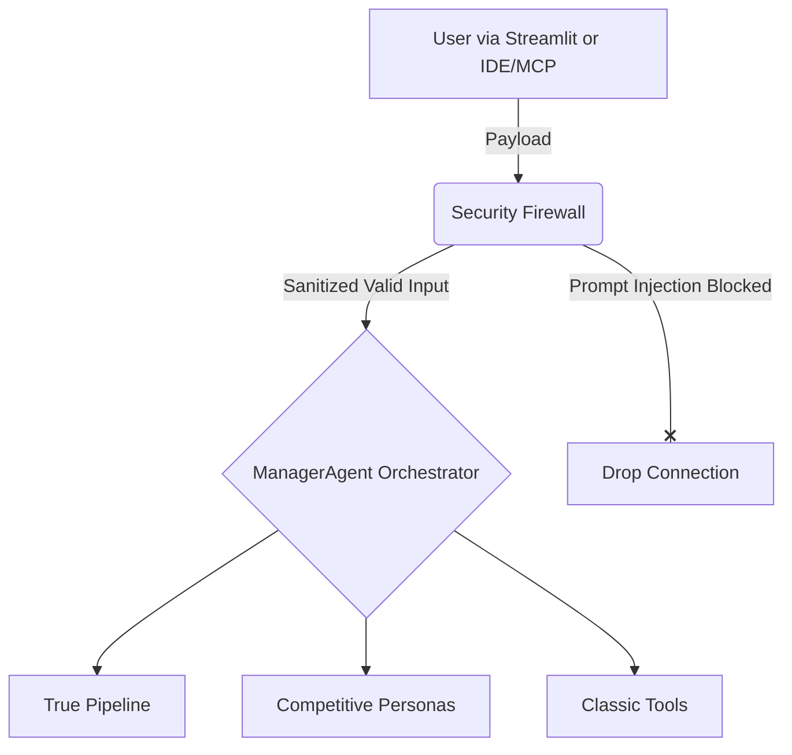
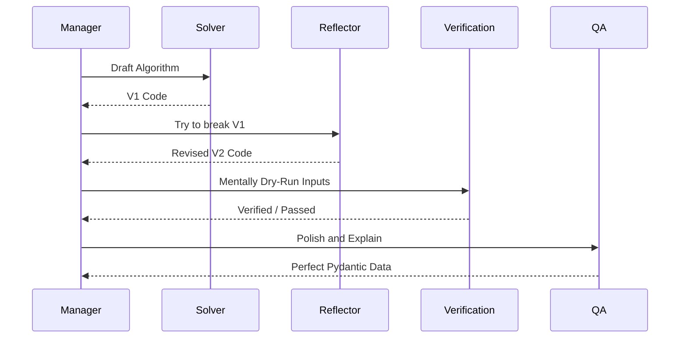
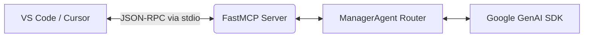
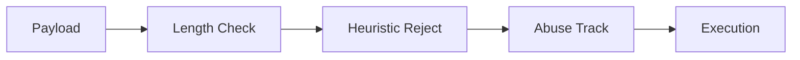

<div align="center">

# 👨‍💻 CodeMentor AI

**An Autonomous Multi-Agent Pipeline That Solves, Critiques, Verifies, and Polishes Programming Code**

[](https://www.python.org/downloads/release/python-3110/)
[](https://streamlit.io/)
[](https://aistudio.google.com/)
[](https://modelcontextprotocol.io/)
[](https://www.docker.com/)
[](https://opensource.org/licenses/MIT)

CodeMentor AI is a state-of-the-art Model Context Protocol (MCP) server and Streamlit dashboard built to eradicate LLM hallucinations in competitive coding. By utilizing a linear state-machine verification pipeline, it moves beyond "single prompt solving" into rigorous adversarial peer-review.

[Read the Kaggle Writeup](KAGGLE_WRITEUP.md) • [View Evaluation Metrics](EVALUATION_METRICS.md) • [Security Architecture](SECURITY_ARCHITECTURE.md)

</div>

---

## 🎥 Demo

> **Note to Judges:** The live video pitch and deployed application links will be placed here.

- 📺 **[Watch the 5-Minute YouTube Pitch Demo Output here](#)**
- 🌐 **[Try the Live Streamlit App here](#)**

![CodeMentor AI Pipeline Demo][(https://via.placeholder.com/800x450.png?text=Placeholder:+GIF+of+Streamlit+Pipeline+Execution](https://youtu.be/mtvfnv7K0fs)

---

## 🛑 The Problem Statement

**Why do modern coding assistants hallucinate?**
Standard generic LLMs are autoregressive predictors, not engineers. When tasked with a dense LeetCode Hard problem, they frequently default to surface-level logic. 
- **Hidden Edge Cases:** Single-shot prompts regularly fail to calculate bounds like integer overflows or $O(N^2)$ bottlenecks.
- **Debugging Blindness:** When AI-generated code fails, feeding the error back to the same monolithic agent often causes cyclic, oscillating hallucinations.
- **Why Multi-Agent?** We must segment the cognitive load. You would not deploy code without a peer review, a QA check, and a security audit. Your AI should not either. 

---

## 💡 The Solution

**CodeMentor AI** introduces a deterministic, multi-agent swarm. 
1. **Multi-Agent Pipeline**: Forces solutions through a sequenced pipeline.
2. **Adversarial Reflection**: A dedicated agent whose *only* job is to brutally critique the code.
3. **Verification Layer**: Acts as an air-gapped simulation proxy, mentally dry-running inputs.
4. **Security Firewall**: A strict `O(1)` memory limiter blocking prompt injections *before* API generation.
5. **MCP Integration**: Fully integrates all agents natively into IDEs (VS Code/Cursor).

---

## ✨ Key Features

| Capability | Description | Specialized Agent |
| :--- | :--- | :--- |
| **🧠 Deep Problem Solving** | Solves and mathematically optimizes algorithms based on constraints. | `SolverAgent` |
| **🐛 Logical Debugging** | Isolates silent logic flaws mapping them to line-by-line fixes. | `DebugAgent` |
| **📈 Complexity Analysis** | Exact Big $O$ Time/Space calculations highlighting bottlenecks. | `ComplexityAgent` |
| **🛡️ Edge Case Generation** | Hunts the specific maximum bounds that cause Memory Limit Exceeded. | `TestCaseAgent` |
| **👔 FAANG Mock Interview** | Refuses to write the code; uses Socratic probing to test your skills. | `InterviewAgent` |
| **🏆 Contest Strategy** | Parses problem sets targeting time-management and difficulty estimates. | `StrategyAgent` |
| **🔎 Strict Code Review** | Acts as an aggressive Principal Engineer enforcing Pythonic paradigms. | `CodeReviewAgent` |
| **🚨 Security Firewall** | Active heuristic scanner blocking jailbreaks and Denial of Wallet (DoW). | `SecurityFirewall` |

---

## 📐 Architecture Diagrams

### System Architecture
The top-level interaction between the user interface, the Security Firewall, and the LLM Pipeline.



### The True Agent Flow Pipeline
This diagram illustrates the State-Machine generator logic replacing the flawed "single LLM call".



### IDE MCP Integration


---

## 🔌 MCP Integration Details

Model Context Protocol (MCP) allows your local IDEs to utilize CodeMentor's unique persona-driven logic natively. CodeMentor exposes the following precise tools:

| MCP Tool Name | Description |
| --- | --- |
| `solve_problem_pipeline` | Triggers the 4-stage Reflection loop for highly reliable code generation. |
| `review_code` | Triggers the Strict Code Reviewer formatting style outputs. |
| `interview_question_generator`| Converts the IDE into a Socratic questioning loop for interview prep. |
| `hidden_test_detector` | Maps adversarial test cases trying to crash the current IDE buffer. |
| `optimize_algorithm` | Highlights $O(N)$ Big O limits. |
| `coding_strategy` | Evaluates Contest parameters. |

---

## 🔒 Security Posture

AI security requires defense-in-depth methodologies. We do not rely on just prompting `"Do not be malicious"`. 

- **Prompt Injection Firewall:** Employs RegExp blacklists immediately rejecting known jailbreak inputs (`ignore previous`).
- **Denial of Wallet (DoW) Limits:** Strict string bounds mapping applied *before* the prompt touches the API.
- **Session Abuse Detection:** Rolling 60-second window limiting spam bot execution.
- **Execution Proxy:** We utilize semantic Agent dry-runs rather than exposing native `eval` or `exec` OS vectors.



---

## 📊 Quantitative Benchmarks

> **Metrics context:** *Benchmarking executed via simulated Leetcode Hard parameters comparing zero-shot execution versus the V2 Reflection Pipeline.*

| Execution Mode | Prompt Type | Pass@1 Accuracy | Latency (Avg) | Safety / Firewall |
| --- | --- | --- | --- | --- |
| Standard LLM | Zero-Shot Generalized | [Insert %] | [Insert sec] | Bypassable |
| **CodeMentor (V2)** | Pipeline Verification | **[Insert %]** | **[Insert sec]** | **Enforced** |

*See `EVALUATION_METRICS.md` for our raw execution trace outputs and methodology.*

---

## 📸 Presentation & Screenshots

### The Timeline Dashboard


### The Socratic Mock Interview


### VS Code MCP Execution


### Security Attack Mitigation


---

## 🚀 Installation & Local Setup

### 1. Repository Clone & Environment
```bash
git clone https://github.com/yourusername/codementor-ai.git
cd codementor-ai

# Python 3.11+ is strongly recommended
python -m venv venv
source venv/bin/activate
pip install -r requirements.txt
```

### 2. Environment Variables
Copy the template and insert your `GEMINI_API_KEY`:
```bash
cp .env.example .env
```

### 3. Execution (Docker & Native)

**Running the Web Interface (Native Streamlit):**
```bash
streamlit run frontend/app.py
```

**Running inside secure Docker containers:**
```bash
docker-compose up --build
```

**Running the MCP Server for your local IDE:**
```bash
python -m mcp_server_ext.server
```

---

## 📂 Project Structure

```text
codementor-ai/
├── agents/                  # The Multi-Agent Intelligence Core
│   ├── manager_agent.py     # Pipeline State-Machine Router
│   ├── reflection_agent.py  # Adversarial Code Critique Component
│   ├── verification_agent.py# Code fact-checking proxy
│   ├── strategy_agent.py    # Competitive Programming Guide
│   └── (..other agents)
├── core/                    # System Integrations
│   ├── config.py            # Pydantic Settings validator
│   └── security.py          # Strict Firewall & Rate Limit logic
├── frontend/
│   └── app.py               # Glassmorphic Streamlit SaaS
├── mcp_server_ext/
│   └── server.py            # FastMCP native IDE extension bindings
├── .env.example
├── docker-compose.yml
├── requirements.txt
└── README.md
```

---

## 🛣️ Roadmap

- [x] Abstract initial AI logic into Pydantic structured schemas.
- [x] Create a multi-stage generator state machine (`run_pipeline`).
- [x] Deploy the Model Context Protocol (MCP) integrations.
- [x] Build the Memory/Abuse Security Firewall.
- [ ] Connect a true virtualized sub-process REPL (e.g., gVisor) for compilation testing.
- [ ] Implement Session History export to Cloud Storage (AWS S3/GCP).

---

## 🤝 Contributing

We welcome competitive programmers, ML researchers, and open-source contributors to the CodeMentor ecosystem!

1. Fork the Project.
2. Create your Feature Branch (`git checkout -b feature/AmazingAgent`).
3. Commit your Changes (`git commit -m 'Added memory constraint agent'`).
4. Push to the Branch (`git push origin feature/AmazingAgent`).
5. Open a Pull Request.

Please ensure any new `Agent` inherits from `agents.base_agent` and defines a strict Pydantic Output schema.

---

## 📄 License

Distributed under the MIT License. See `LICENSE` for more information.

---

## 🙏 Acknowledgements

* **[Google Gemini](https://aistudio.google.com/)**: For the powerhouse reasoning backing the multi-agent ensemble.
* **[Model Context Protocol (MCP)](https://modelcontextprotocol.io/)**: For the standard enabling our IDE extensibilities.
* **[Streamlit](https://streamlit.io/)**: For the rapid modern dashboard frontend pipeline.
* **[Kaggle](https://kaggle.com/)**: For catalyzing this Capstone design standard.

<div align="center">
  <b>Architected for the Kaggle Capstone AI Agents competition.</b>
</div>
